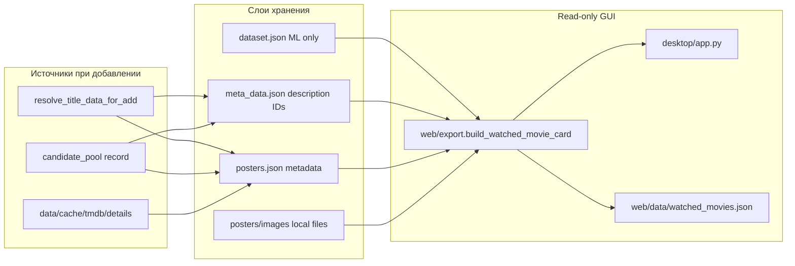

# План: описания и постеры для dataset + candidates (консоль → GUI)

## Диагноз (почему сейчас «Нет постера» и пустое описание)

Проверка реальных данных: **52 записи в dataset, 56 в meta — poster-полей нет ни там, ни там**.

| Что нужно GUI | Где должно жить | Что есть сейчас |
|---|---|---|
| Описание | [`meta_data.json`](C:/META/meta-movies-learn/meta_data.json) (`description`) | Сохраняется **только** при переносе из pool ([`build_candidate_meta_payload`](dataset/title_resolve.py)); ручное «Добавить запись» — **нет** |
| Poster URL/path | [`data/cache/posters/posters.json`](data/cache/posters/posters.json) | Модуль [`posters/cache.py`](posters/cache.py) есть, но **файл не создаётся** автоматически; `local_path` всегда `null` |
| Dataset | [`dataset.json`](C:/DATA/movies-learn/dataset.json) | Только ML-поля ([`config/scheme.py`](config/scheme.py)) — **poster/overview туда не кладём** (осознанно) |
| Кандидаты TMDb | `candidate_pool.json` / snapshots | `overview`, `poster_path`, `poster_url` **уже есть** в TMDb-build ([`apis/tmdb_api.py`](apis/tmdb_api.py)); legacy KP-pool — только `description`, без poster |
| Чтение для GUI | [`web/export.py`](web/export.py) → desktop / web export | `overview` ищется **только в movie-dict**, **не в meta**; poster — movie + cache, cache пуст |

Уже есть полезный read-only resolver описаний для отчётов: [`resolve_movie_description`](model/train_report.py) (meta → pool → TMDb details cache). Его нужно **переиспользовать**, а не дублировать.

---

## Принципы архитектуры (не менять)



- **Dataset format не трогаем** — описание и poster не в `main_info` / `raw_scores`.
- **Poster-cache — отдельный слой**, не `reports/`, не `web/data/` (экспорт только для GUI).
- **Запись — через консоль** ([`ui/console/interface_funcs.py`](ui/console/interface_funcs.py)); **desktop остаётся read-only**.
- **Постеры в 2 шага** (ваш выбор): сначала metadata в `posters.json`, потом отдельная загрузка в `images/`.

---

## Фаза 1 — Исправить read-path для GUI (быстрый эффект)

**Цель:** PyQt6 и web export показывают описание, если оно уже есть в meta/pool/TMDb cache.

**Изменения в [`web/export.py`](web/export.py):**
- Добавить `_resolve_overview(movie, meta_obj=None)` с приоритетом:
  1. поля на movie (`overview`, `description`, …) — как сейчас;
  2. `meta_obj["description"]`;
  3. опционально — thin wrapper над `resolve_movie_description` (pool + TMDb details cache), **без API-запросов**.
- В `build_watched_movie_card`: принимать опциональный `meta_obj` или загружать через `storage.data.get_meta_obj(title)` один раз на карточку.
- В `export_watched_movies_json`: при обходе dataset подгружать meta map (как в [`train_report`](model/train_report.py)) — один проход, без N× disk read.

**Desktop:** [`desktop/watched_view.py`](desktop/watched_view.py) — без write-логики; карточки автоматически получат `overview` через обновлённый export.

**Тесты:** расширить [`tests_pytest/test_poster_cache.py`](tests_pytest/test_poster_cache.py) или новый `test_web_export_meta.py`; не ломать [`tests/test.py`](tests/test.py) `test_build_watched_movie_card`.

---

## Фаза 2 — Сохранять metadata при добавлении (консоль)

**Цель:** новые и перенесённые записи сразу получают description + poster metadata.

### 2a. Ручное добавление («Данные → Добавить запись»)

Сейчас: [`request_object()`](ui/console/interface_funcs.py) → `add_movie(...)` **без** `meta_payload`.

Добавить в [`dataset/title_resolve.py`](dataset/title_resolve.py):
```python
def build_add_meta_payload(resolve_result: dict) -> dict
```
- `description` из `source_values["description"]` или `tmdb_data["overview"]` / KP description;
- `tmdb_id`, `imdb_id`, `kp_id`, `source` — если есть в resolve;
- **не** класть poster в meta (poster → cache).

В `request_object()`: после resolve передать `meta_payload=build_add_meta_payload(...)` в `storage_movie.add_movie()`.

### 2b. Перенос из pool («Отметить просмотренные»)

Расширить [`build_candidate_meta_payload`](dataset/title_resolve.py):
- `description` ← `description` **или** `overview`;
- добавить ключи для cache-sync: `poster_path`, `poster_url` (в meta **не обязательно** сохранять poster — достаточно передать в cache helper).

### 2c. Sync poster-cache при записи

Новые функции в [`posters/cache.py`](posters/cache.py):
```python
upsert_poster_cache_entry(title, year, poster_info, cache=None) -> dict
sync_poster_cache_from_meta_and_sources(title, year, meta_obj, movie=None) -> dict
```
- Вызывать из [`add_dataset_record`](dataset/dataset_records.py) **после успешного save** (read existing cache → merge entry → `save_poster_cache`).
- Источники для entry: `extract_existing_poster_info(movie + meta)` + поля кандидата при transfer.
- `local_path` пока `null`, `status`: `found` / `missing`.

**Тесты:** pytest на `build_add_meta_payload`, upsert cache, mutation-free dataset/meta.

---

## Фаза 3 — Batch backfill для уже просмотренных (52 записи)

**Консольное меню** (рекомендуемое место: **Дополнительно** → новый пункт, или **Данные → 9**):

«Обновить описания и poster-cache для просмотренных»

Новый модуль [`posters/sync_watched.py`](posters/sync_watched.py) (или `scripts/sync_watched_metadata.py` + thin wrapper в console):
1. `load_dataset()` + `load_meta()` + optional `load_candidate_pool()` для lookup.
2. Для каждой записи:
   - description: `resolve_movie_description(...)` → если meta пуст — **дописать** `meta.description` (единственная запись в meta, не dataset);
   - poster: `extract_existing_poster_info` + pool/TMDb cache → `upsert_poster_cache_entry`.
3. Прогресс + summary: found/missing/updated.

**Важно:** backfill **может писать meta** (только `description` и IDs), **не dataset**.

---

## Фаза 4 — Poster metadata из TMDb (без скачивания файлов)

**Меню:** Дополнительно → «Загрузить poster URL из TMDb (metadata)»

Новый [`posters/fetch_metadata.py`](posters/fetch_metadata.py):
- Берёт записи из dataset + meta с `tmdb_id`, у которых в cache `status=missing`.
- **Сначала** читает [`data/cache/tmdb/details/{id}_{lang}.json`](apis/tmdb_api.py) (уже может быть на диске).
- **Только если cache пуст** — один вызов TMDb details API (существующий `get_tv_details`, не новый HTTP-клиент).
- Пишет `poster_path`, `poster_url` (`build_tmdb_poster_url`), `source: "tmdb_api"` в `posters.json`.
- **Не** скачивает images, **не** меняет dataset/candidate_pool.

Для **кандидатов в pool** (ещё не watched): опциональный подпункт в «Диагностика pool» — обогатить записи без poster через TMDb id (обновляет `candidate_pool.json`, не dataset).

---

## Фаза 5 — Скачивание poster images (отдельный шаг)

**Меню:** Дополнительно → «Скачать poster images локально»

Новый [`posters/download_images.py`](posters/download_images.py):
- Читает `posters.json` entries с `poster_url` и `local_path=null`.
- Скачивает в `data/cache/posters/images/{identity_key}.jpg` (urllib/request, лимит размера, skip on error).
- Обновляет `local_path`, `updated_at`.
- PyQt6 [`resolve_local_poster_path`](desktop/watched_view.py) начнёт показывать картинки **без сети в runtime**.

Static web GUI: может использовать `poster_url` (браузер) или relative path к images — отдельное решение в JS, не блокер фазы 5.

---

## Фаза 6 — Кандидаты: что показывать до переноса в dataset

| Тип кандидата | Описание | Poster | Действие |
|---|---|---|---|
| TMDb pool snapshot / common pool после import | уже в JSON | уже в JSON | Убедиться, что pool viewer ([`interface_funcs`](ui/console/interface_funcs.py) list candidates) печатает description; при необходимости — одна строка poster URL |
| Legacy KP pool | `description` | нет | Фаза 4 batch по `tmdb_id` или title search |
| После transfer → watched | meta + cache | cache | Фазы 2–5 |

Отдельный poster-cache для pool **не нужен** на первом шаге — данные уже в `candidate_pool.json`; cache нужен для **watched identity** (`title|year`).

---

## Файлы по фазам

| Фаза | Новые | Изменяемые |
|---|---|---|
| 1 | — | [`web/export.py`](web/export.py), возможно [`desktop/watched_view.py`](desktop/watched_view.py) (минимально) |
| 2 | — | [`dataset/title_resolve.py`](dataset/title_resolve.py), [`dataset/dataset_records.py`](dataset/dataset_records.py), [`posters/cache.py`](posters/cache.py), [`ui/console/interface_funcs.py`](ui/console/interface_funcs.py) |
| 3 | `posters/sync_watched.py` | [`ui/console/ui.py`](ui/console/ui.py), [`ui/console/global_menu.py`](ui/console/global_menu.py) |
| 4 | `posters/fetch_metadata.py` | console menus |
| 5 | `posters/download_images.py` | console menus |
| 6 | — | pool display в [`interface_funcs.py`](ui/console/interface_funcs.py) (косметика) |

**Не трогаем:** `config/scheme.py`, обучение, weights, candidate_pool format, top prediction, [`tests/test.py`](tests/test.py) (кроме новых тестов при необходимости).

---

## Проверки после каждой фазы

```powershell
C:\Users\super\AppData\Local\Programs\Python\Python313\python.exe -m pytest tests_pytest/
C:\Users\super\AppData\Local\Programs\Python\Python313\python.exe tests\test.py
C:\Users\super\AppData\Local\Programs\Python\Python313\python.exe -m compileall ... posters web desktop
```

Ручная проверка GUI:
1. `py start_app.py` — описание и poster (после фазы 5 — локальный файл).
2. Опционально: export → `web/data/watched_movies.json`.

---

## Ожидаемый результат для пользователя

**После фаз 1–3:** desktop показывает описания для записей с meta; poster-cache заполнен metadata где возможно из существующих источников.

**После фазы 4:** у записей с `tmdb_id` появляются `poster_url` в cache (в т.ч. ваши 52 title без poster в dataset).

**После фазы 5:** PyQt6 показывает реальные постеры из `data/cache/posters/images/`.

**Desktop GUI editing** (оценки, добавление) — **следующий этап**, не в этом плане.

---

## Почему не другие варианты

- **Poster в dataset** — нарушает разделение ML-данных и display metadata, раздувает backup.
- **Poster в reports/** — отчёты одноразовые, не living cache.
- **Poster в web/data/** — производный экспорт, не source of truth.
- **Скачивание в фазе 2** — смешивает metadata и I/O; вы выбрали двухшаговый подход.
