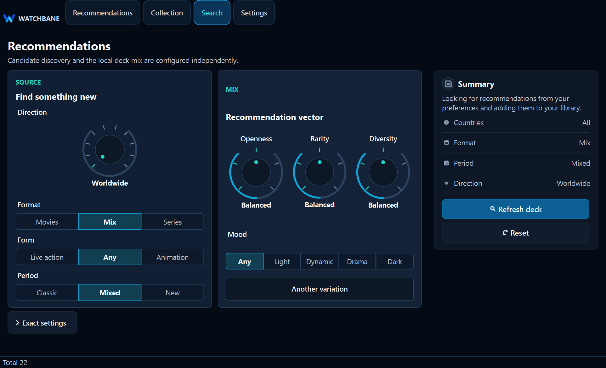

# Watchbane

[](https://github.com/veitnemed/watchbane/actions/workflows/tests.yml)
[](#getting-started)
[](#your-data-stays-yours)
[](LICENSE)

**A personal movie and series recommender that learns from your choices, not a streaming platform's agenda.**

Watchbane brings your watched collection, saved titles and a living recommendation deck into one focused Windows app. Choose a direction, adjust how adventurous the mix should be, and get a queue you can understand and control.

<p align="center">
  
</p>

## Find the next title, not another endless catalogue

Watchbane is built around a simple idea: recommendations should feel personal without becoming mysterious.

- **A fresh deck for you.** Get a focused set of recommendations instead of scrolling through thousands of titles.
- **Taste controls you can feel.** Move from familiar to unusual, popular to rare, focused to diverse.
- **Movies and series together.** Keep one collection while still controlling format, period, animation and mood.
- **Clear reasons and signals.** See genres, country, release details, TMDb rating and recommendation strength.
- **One-click decisions.** Mark a title watched, save it for later or hide it from future decks.
- **Deck reserve at a glance.** A circular indicator in Recommendations shows how much of your current deck is still available (target 25) and turns red when it is time to refresh. Details: [deck reserve report](docs/reports/2026-07/otchet_deck_reserve_indicator.md).
- **A persistent local pool.** Your candidate pool survives restarts and is not rebuilt every time the app opens.

## Tune the recommendation, not the algorithm

Start with a direction such as worldwide, Hollywood, Russian mainstream, anime, K-drama or European detective. Then shape the result with a small set of visual controls. Exact country, year, genre and TMDb filters remain available when you need them.

<p align="center">
  
</p>

The default screen stays compact. Detailed filters open only on demand, so everyday use never feels like filling out a database form.

## Your collection, your rules

Watchbane keeps three practical lists:

| List | Purpose |
| --- | --- |
| **Watched** | Titles you have seen, including your personal rating |
| **Saved** | Titles you may want to watch next |
| **Hidden** | Recommendations you do not want to see again |

Every action improves the working deck without deleting the original metadata. You can change direction, ask for another variation or return to saved titles later.

## Your data stays yours

Watchbane is local-first. Your collection, ratings, candidate pool, settings and poster cache live on your computer. The app uses TMDb to find titles and enrich metadata, but your personal library is not uploaded to a Watchbane account.

The TMDb token entered during setup is stored locally. Watchbane does not bundle a shared token and does not send it anywhere except TMDb API requests.

## Getting started

### Windows EXE

Release builds are folder-based. Run `Watchbane.exe` from `dist/Watchbane/` and keep its `_internal/` directory beside it. On the first launch:

1. Watchbane checks whether TMDb is reachable.
2. Paste your TMDb API Read Access Token (Bearer token).
3. Choose a starting direction and a few taste preferences.
4. Wait while the first candidate pool and poster cache are prepared.
5. Open Recommendations and start rating, saving or hiding titles.

If TMDb resolves to `127.x` in Russia, enable a VPN or secure DNS and restart Watchbane before entering the token.

### Run from source

Watchbane currently targets Python 3.13+ on Windows.

```powershell
py -m pip install -r requirements.txt
py start_app.py
```

For development and tests, install the extended set:

```powershell
py -m pip install -r requirements-dev.txt
py -m pytest -q
```

Plotly analytics, WebEngine charts and ML experiments are optional and can be installed separately:

```powershell
py -m pip install -r requirements-experiments.txt
```

Without the optional set, the app remains usable and shows local UI fallbacks for unavailable analytics widgets.

The maintenance console remains available through:

```powershell
py start_console.py
```

### Build a Windows release

The MVP release uses PyInstaller **onedir** mode, not a single-file executable. This keeps the executable and its bundled runtime/assets together in `dist/Watchbane/`.

```powershell
./tools/build_desktop.ps1
./dist/Watchbane/Watchbane.exe
```

Do not move `Watchbane.exe` out of that folder: it depends on the adjacent `_internal/` runtime directory.

## What Watchbane remembers

- watched titles and personal ratings;
- saved and hidden decisions;
- your candidate pool;
- recommendation direction and vector settings;
- interface scale and language;
- downloaded poster previews;
- the current local recommendation deck;
- deck reserve level on the Recommendations tab (remaining active + reserve cards vs target size 25).

Opening the application does **not** immediately refresh the pool. New TMDb candidates are requested after an explicit search/filter action or a later background maintenance check when automatic refill is enabled.

## Languages and scale

The interface and title metadata can be switched independently between Russian and English. Application scale is also independent from Windows display scaling, which makes Watchbane usable on high-DPI displays without changing the operating system setting.

UI changes should be checked at application scales **0.75**, **1.0**, and **1.5**. Personal reactions use a three-level scale: `1` — not for me, `2` — okay, `3` — top; watched cards show it as a compact heart-and-number badge.

## For contributors

The product is a PyQt6 desktop application with a local SQLite runtime, TMDb integration and an extensive automated test suite.

```powershell
py -m pytest
```

Start with the documentation map for architecture, storage contracts, candidate flow and UI scaling:

- [Architecture overview](docs/architecture/OVERVIEW.md)
- [Documentation index](docs/README.md)
- [Project map](docs/architecture/PROJECT_MAP.md)
- [Candidate queue and posters](docs/architecture/CANDIDATE_QUEUE_AND_POSTERS.md)
- [UI scale contract](docs/contracts/UI_SCALE_CONTRACT.md)

## TMDb attribution

This product uses the TMDb API but is not endorsed or certified by TMDb. Movie and series metadata, images and related content are provided through TMDb under its applicable terms.

## License

Watchbane is available under the [MIT License](LICENSE).
