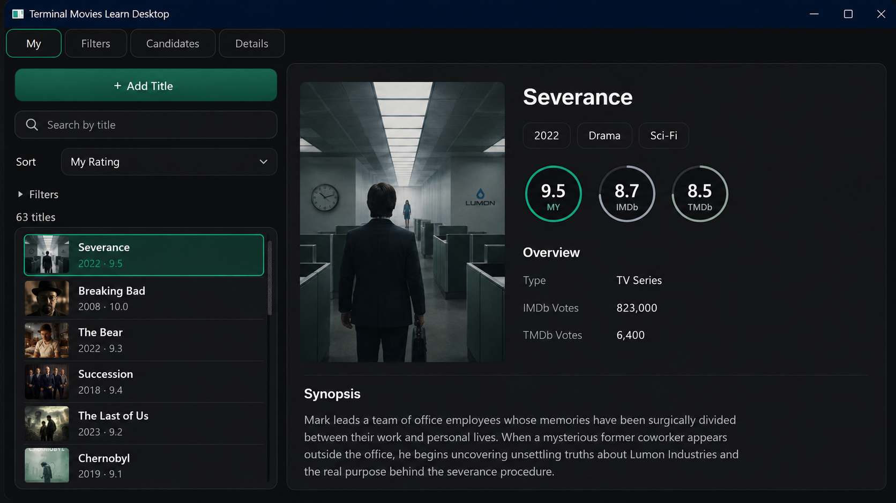

# Watchbane

[](https://github.com/veitnemed/watchbane/actions/workflows/tests.yml)
[](https://www.python.org/)
[](https://www.riverbankcomputing.com/software/pyqt/)
[](docs/DATA_STORAGE_PLAN.md)
[](LICENSE)

**The local-first app that turns your watchlist into a ranked candidate pool.**

Watchbane helps you keep your own watched base, discover new films and series, compare signals from TMDb / IMDb / KP, and move good candidates into your personal library without giving the whole process to a black-box service.

It is local-first, inspectable, and built around a persistent candidate pool instead of one-off search results.

<p align="center">
  
</p>

<p align="center">
  <strong>Your watched library, recommendations, ratings and metadata in one local desktop workspace.</strong>
</p>

## The Idea

Streaming platforms know what they want to sell. Watchbane is for what **you** want to track, compare and remember.

You keep the source of truth locally. The app enriches it with external metadata, but does not surrender your data model to any external platform.

```text
watched library
   + candidate pool
   + TMDb discovery
   + IMDb / KP signals
   + poster cache
   + PyQt desktop UI
```

## What Makes It Different

| Instead of... | Watchbane gives you... |
| --- | --- |
| A throwaway search result | A persistent candidate pool you can filter, clean and revisit |
| A locked platform watchlist | Local JSON data you can inspect and back up |
| Blind recommendations | Visible signals: ratings, votes, country, type, metadata completeness |
| Manual copy-paste | Add-title and candidate-transfer flows with preview and confirmation |
| A pile of scripts | Clear UI / Domain / Infra / Project architecture |

## Current Experience

- **My library**: browse watched titles with posters, ratings, metadata and detail cards.
- **Candidates**: search a shared pool of possible next titles, hide noise, transfer good picks.
- **Information**: inspect read-only analytics without mutating your data.
- **TMDb build flow**: discover candidates by country/mode, enrich them, import into the shared pool.
- **Poster cache**: keep preview posters local and avoid waiting on CDN during normal browsing.
- **Console tools**: maintenance, diagnostics, imports and longer-running operations stay available.

## Preview

<table>
  <tr>
    <td width="50%">
      
    </td>
    <td width="50%">
      
    </td>
  </tr>
  <tr>
    <td><strong>My library</strong><br>Personal ratings, public scores, posters, metadata and synopsis.</td>
    <td><strong>Candidate pool</strong><br>Ranked recommendations with filters, hide/transfer actions and vote signals.</td>
  </tr>
</table>

## Built For

- people who rate films and series seriously;
- local-first workflows;
- custom recommendation experiments;
- personal media datasets;
- Python/PyQt projects that should stay understandable while growing.

## Architecture

Watchbane keeps the physical folder layout simple, but treats the project as four logical zones:

| Zone | Purpose |
| --- | --- |
| `UI` | `app/`, `desktop/`, `ui/`, `web/` |
| `Domain` | `dataset/`, `candidates/`, `posters/` |
| `Infra` | `apis/`, `storage/`, `config/`, `common/` |
| `Project` | `tests/`, `docs/`, `scripts/`, `assets/` |

Start here if you want to understand the code:

- [Logical architecture](docs/LOGICAL_ARCHITECTURE.md)
- [Project map](docs/PROJECT_MAP.md)
- [Desktop module map](docs/DESKTOP_MODULE_MAP.md)
- [Detailed docs README](docs/README.md)

## Run It

Watchbane is developed primarily on Windows with Python 3.13+.

```powershell
py -m pip install -r requirements.txt
py start_app.py
```

Console UI:

```powershell
py start_console.py
```

Tests:

```powershell
py -m pytest
```

TMDb flows need `TMDB_TOKEN` in the environment, `.env.local`, or `tmdb.env`.

## Repository Notes

- Runtime user data lives under `data/` and is ignored by git.
- Large local IMDb resources live under `datasets/` and are ignored by git.
- Legacy experiments live under `archive/` and are not active runtime.
- Contribution and project hygiene docs live in [`docs/`](docs/).

## Contributing

Issues and focused pull requests are welcome, especially around GUI polish, candidate ranking, metadata quality and offline tests.

- [Contributing](docs/CONTRIBUTING.md)
- [Security](docs/SECURITY.md)
- [Code of conduct](docs/CODE_OF_CONDUCT.md)

## License

MIT. See [LICENSE](LICENSE).
