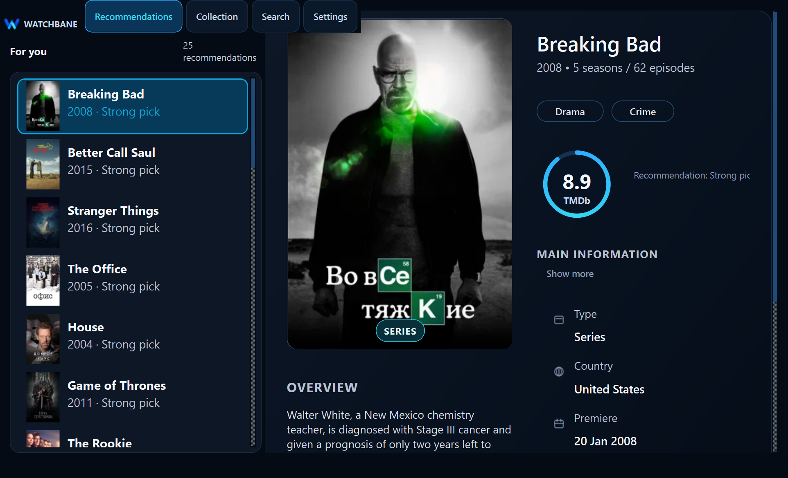

# Watchbane

[](https://github.com/veitnemed/watchbane/actions/workflows/tests.yml)
[](#быстрый-старт)
[](VERSION.md)
[](VERSION.md)
[](#данные-остаются-у-вас)
[](LICENSE)

**Личный inbox рекомендаций** — разобрать порцию фильмов и сериалов (смотрел / сохранить / скрыть), а не стриминг и не «что смотреть сегодня вечером».

Текущий релиз: **Watchbane 0.1.1-alpha.1 — Open Route**. Движок рекомендаций: **ReDeck v0.1.0**. См. [контракт версии](VERSION.md) и [заметки о релизе](RELEASE_NOTES.md).

Watchbane — локальное Windows-приложение: **конечная колода до 10 карточек** с постерами. Вы разбираете кандидатов в списки, приложение учитывает прошлые решения при следующих колодах. Канон: [PRODUCT_ROADMAP_CONTRACT](docs/contracts/PRODUCT_ROADMAP_CONTRACT.md) (**вариант X — inbox**). Карта документации: [docs/README.md](docs/README.md).

<p align="center">
  
</p>

## Разобрать рекомендации, а не бесконечный каталог

Watchbane — inbox: порция кандидатов → три решения → списки обновлены.

- **Своя колода.** До **10** карточек с постерами вместо бесконечного скролла.
- **Три решения.** **Смотрел** / **сохранить** / **скрыть** (не like/dislike и не «выбрал смотреть сегодня»).
- **Фильмы и сериалы вместе.** Одна коллекция по итогам разбора.
- **Понятные сигналы.** Жанры, страна, год, рейтинг TMDb на карточке.
- **Без обязательных фильтров.** Daily path не требует «Настройки поиска» и детальной настройки выдачи.

## Коллекция — по вашим правилам

Watchbane ведёт три практических списка:

| Список | Назначение |
| --- | --- |
| **Смотрел** | Уже виденные тайтлы, включая личную оценку |
| **Сохранить** | То, что хочется посмотреть позже |
| **Скрыть** | Рекомендации, которые не нужно показывать снова |

Каждое действие обновляет рабочие списки и влияет на следующие колоды. Коллекция (Моё) — результат разбора, не замена колоды.

## Данные остаются у вас

Watchbane — local-first. Коллекция, оценки, настройки и кэш постеров живут на вашем компьютере. Приложение обращается к TMDb за тайтлами и метаданными, но личная библиотека никуда не «загружается» в аккаунт Watchbane.

Токен TMDb, введённый при настройке, хранится локально. Watchbane не поставляет общий токен и не отправляет его никуда, кроме запросов к TMDb API.

## Быстрый старт

### Windows EXE

Релизные сборки — папочные (onedir). Скачайте и распакуйте `Watchbane-0.1.1-alpha.1-windows-x64.zip`, затем запустите `Watchbane.exe` внутри папки `Watchbane/`. Держите `_internal/` рядом. При первом запуске:

1. Watchbane проверяет доступность TMDb.
2. Вставьте TMDb API Read Access Token (Bearer).
3. При необходимости пройдите короткий онбординг предпочтений.
4. Дождитесь подготовки колоды с постерами (один экран ожидания).
5. Откройте **Рекомендации** и разбирайте: смотрел / сохранить / скрыть.

Если TMDb резолвится в `127.x`, на экране токена используйте **Попробовать обход**. Подробности: [TMDB_NETWORK_TROUBLESHOOTING](docs/TMDB_NETWORK_TROUBLESHOOTING.md).

### Запуск из исходников

Watchbane ориентирован на Python 3.13+ под Windows.

```powershell
py -m pip install -r requirements.txt
py start_app.py
```

Для разработки и тестов:

```powershell
py -m pip install -r requirements-dev.txt
py -m pytest -q
```

### Сборка Windows-релиза

Watchbane 0.1.1-alpha.1 собирается PyInstaller в режиме **onedir**, не в один файл.

```powershell
./tools/build_desktop.ps1
./dist/Watchbane/Watchbane.exe
```

Не выносите `Watchbane.exe` из этой папки: ему нужна соседняя директория `_internal/`.

## Что Watchbane помнит

- просмотренные тайтлы и личные оценки;
- решения сохранить и скрыть;
- текущую колоду рекомендаций;
- масштаб интерфейса и язык;
- скачанные превью постеров.

## Язык и масштаб

Интерфейс и метаданные тайтлов переключаются независимо между русским и английским. Масштаб приложения независим от масштаба Windows.

UI-изменения в фазе C проверяются на масштабах **1.0** и **1.25**.

## Для участников

Watchbane — desktop-приложение на PyQt6 с локальным SQLite, интеграцией TMDb и автотестами.

```powershell
py -m pytest
```

Начните с карты документации:

- [Контракт продукта и roadmap](docs/contracts/PRODUCT_ROADMAP_CONTRACT.md)
- [Happy path inbox](docs/contracts/HAPPY_PATH_INBOX.md)
- [Индекс документации](docs/README.md)
- [Обзор архитектуры](docs/architecture/OVERVIEW.md)
- [Контракт UI scale](docs/contracts/UI_SCALE_CONTRACT.md)
- [Правила агента](AGENTS.md)

**Не в Phase C (parking):** богатые сочетания фильтров (A), NL-слой (B), сценарий «Сегодня» (V0). Не обещаются как уже доступный продукт.

## Атрибуция TMDb

Продукт использует TMDb API, но не одобрен и не сертифицирован TMDb. Метаданные фильмов и сериалов, изображения и связанный контент предоставляются через TMDb на условиях этой службы.

## Лицензия

Watchbane распространяется по [лицензии MIT](LICENSE).
