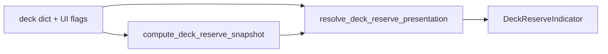

# Отчёт: индикатор «Запас колоды» на вкладке «Рекомендации»

- Дата: 2026-07-12
- Область: header вкладки «Рекомендации» — круговой индикатор остатка локальной колоды

## Зачем нужен индикатор

Пользователь видит карточки по одной, но не понимает, **сколько рекомендаций ещё осталось** и **когда имеет смысл обновить колоду**. После серии действий «Смотрел» / «Скрыть» запас тает незаметно, а фоновое пополнение пула через TMDb может идти отдельно от текущей подборки.

Индикатор закрывает простой вопрос:

> «Сколько у меня ещё доступных рекомендаций в этой колоде и насколько она «полная»?»

Это **не** оценка качества алгоритма и **не** точность матчинга — только **реальный остаток** карточек, которые ещё можно показать в текущей сессии, с учётом уже принятых решений.

## Что показывает

| Элемент | Смысл |
| --- | --- |
| **Кольцо** | Доля оставшегося запаса от целевого размера колоды (25): `min(remaining / 25, 100%)` |
| **Цвет** | Плавный переход красный → зелёный по заполнению кольца |
| **Центр** | Процент, например `72%` |
| **Tooltip** | «Осталось N доступных рекомендаций» — полный остаток, включая reserve |
| **Spinner** | Колода ещё собирается или идёт пополнение пула — **без** ложного процента |
| **!** | Ошибка локальной сборки колоды |

### Формула (v1)

```
remaining = len(deck["active"]) + len(deck["reserve"])
target    = deck["active_limit"]   # 25
ratio     = min(remaining / target, 1.0)
```

Примеры: 18 из 25 → 72%; 7 → 28%; полная колода 25+70 в reserve → кольцо 100%, tooltip «95».

### Состояния запаса (band, для следующих итераций UI)

| Доля | Статус |
| --- | --- |
| 60–100% | Колода готова |
| 25–59% | Запас заканчивается |
| 0–24% | Пора обновить |
| 0 | Пусто / обработано |

## Архитектура



1. **Snapshot** — чистая математика в [`candidates/recommendation_deck_service.py`](../../candidates/recommendation_deck_service.py).
2. **Presentation** — state machine без PyQt в [`candidates/deck_reserve_presentation.py`](../../candidates/deck_reserve_presentation.py): не отдаёт процент, пока колода не готова.
3. **Widget** — [`desktop/candidates/deck_reserve_indicator.py`](../../desktop/candidates/deck_reserve_indicator.py).
4. **Интеграция** — [`desktop/candidates/list_view.py`](../../desktop/candidates/list_view.py), header `recommendationsFeedHeader`.

### Защита от ложных 100%

Индикатор **не показывает** готовый процент, когда:

- вкладка «Рекомендации» ещё не активировалась;
- идёт `refresh_deck()` (`deck_build_in_progress`);
- показывается страница подготовки постеров (`deck_prepare_active`);
- сборка упала (`build_failed`);
- идёт replenish локального пула (`session.is_loading` / replenishing).

## Изменённые и новые файлы

| Файл | Назначение |
| --- | --- |
| `candidates/recommendation_deck_service.py` | `DeckReserveSnapshot`, `compute_deck_reserve_snapshot()` |
| `candidates/deck_reserve_presentation.py` | `resolve_deck_reserve_presentation()` |
| `desktop/candidates/deck_reserve_indicator.py` | Круговой виджет, `apply_presentation()` |
| `desktop/candidates/list_view.py` | Wiring, флаги loading/error/replenishing |
| `desktop/i18n/catalog.py` | RU/EN tooltip |
| `desktop/theme/styles/candidates_shell.py` | QSS для `#recommendationsDeckReserveIndicator` |
| `tools/screenshots/capture_deck_reserve_indicator.py` | Screenshot harness `--mode loading\|ready` |
| `tests/test_deck_reserve_snapshot.py` | Unit-тесты формулы |
| `tests/test_deck_reserve_presentation.py` | Unit-тесты state machine |
| `tests/desktop/test_deck_reserve_indicator.py` | Widget modes |

## Проверки

```powershell
py -m pytest tests/test_deck_reserve_snapshot.py tests/test_deck_reserve_presentation.py tests/desktop/test_deck_reserve_indicator.py -q
py -m compileall desktop candidates tests
```

14 тестов — passed.

## Вне scope этого коммита

- Кнопка «Обновить колоду» по band
- Тексты band в UI («Колода готова» / «Запас заканчивается»)
- Центр «18 из 25» вместо процента (оставлен `%` по решению UX)
- Fix аномалии `active=0`, `reserve>0`

## Ручной прогон

1. Открыть «Рекомендации» → spinner, не 100%.
2. Дождаться колоды → реальный % (может быть &lt;100% при underfilled pool).
3. «Смотрел» / «Скрыть» → % уменьшается.
4. «Новая подборка» → снова spinner до готовности.
