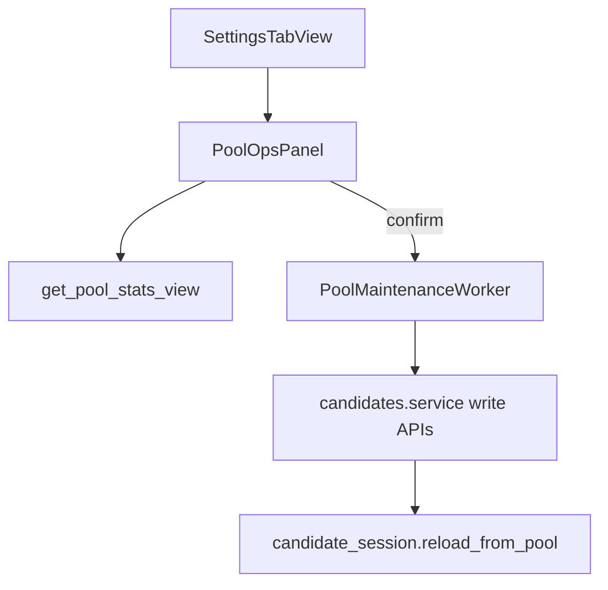

# Отчёт: Desktop Этап 5 — pool maintenance в GUI

- Дата: 2026-07-10
- Область: секция «Управление pool» на вкладке Настройки — stats, dedupe, purge watched, clear, TMDb import/build

## Цель

1. Перенести основные pool maintenance-сценарии из console в desktop Settings без дублирования write-path.
2. Все записи — только через [`candidates/service.py`](../../candidates/service.py).
3. После успешных операций обновлять кандидатов и фильтры без перезапуска.

## Flow



## Изменения

### Desktop

| Модуль | Назначение |
|--------|------------|
| [`desktop/settings/pool_ops_panel.py`](../../desktop/settings/pool_ops_panel.py) | stats + кнопки dedupe/purge/clear/import/build |
| [`desktop/settings/pool_ops_worker.py`](../../desktop/settings/pool_ops_worker.py) | `QThread` для write-операций |
| [`desktop/settings/pool_clear_dialog.py`](../../desktop/settings/pool_clear_dialog.py) | typed confirm ОЧИСТИТЬ / CLEAR |
| [`desktop/settings/tmdb_build_dialog.py`](../../desktop/settings/tmdb_build_dialog.py) | упрощённая форма TMDb Discover |
| [`desktop/settings/tab_view.py`](../../desktop/settings/tab_view.py) | интеграция panel + `on_pool_changed` |
| [`desktop/shell/tabs.py`](../../desktop/shell/tabs.py) | reload session + refresh filters |

### i18n / QSS

- Ключи `settings.pool.ops.*` в [`desktop/i18n/catalog.py`](../../desktop/i18n/catalog.py) (ru/en).
- Стили pool ops в [`desktop/theme/styles/settings.py`](../../desktop/theme/styles/settings.py).

## Поведение

- **Stats**: `get_pool_stats_view()` — summary, detail lines, предупреждение о дублях.
- **Очистить дубли**: confirm → `clean_common_pool_duplicates()`.
- **Убрать уже в watched**: preview count → confirm → `purge_pool_dataset_title_matches()`.
- **Очистить pool**: typed confirm → `clear_common_candidate_pool()`.
- **Импорт TMDb JSON**: `QFileDialog` → `import_tmdb_result_to_pool(path)`.
- **Собрать из TMDb**: dialog (media_type, country, mode, years, score/votes) → `build_and_save_tmdb_candidate_pool` → auto-import JSON в pool.
- Busy state: кнопки disabled, indeterminate progress без cancel (TMDb build не поддерживает cancel в service).
- Успех: signal `poolChanged` → `candidate_session.reload_from_pool(force=True)` + `refresh_candidate_filters()`.

## Вне scope

- Poster batch download (Этап 6).
- Suspicious duplicates viewer, poster diagnostics (console).
- Редактирование saved filter defaults.

## Тесты

```powershell
py -m pytest tests/desktop/test_pool_ops_panel.py tests/desktop/test_tmdb_build_dialog.py tests/candidate_modules/test_service_contract.py -q
```

Результат: 15 passed.
