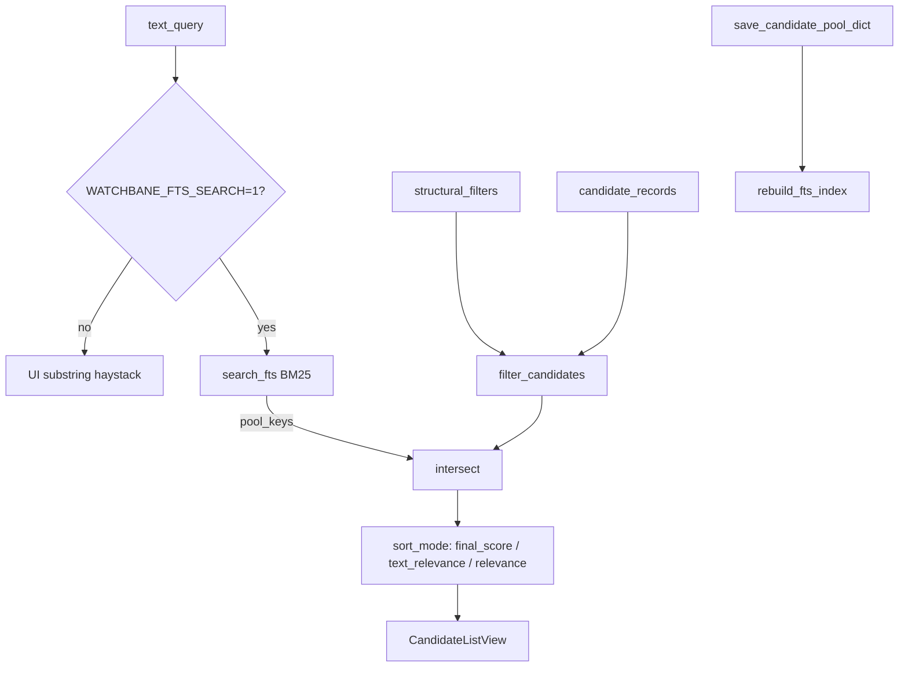

# Отчёт о проделанной работе — локальный поиск Steps 2–4

- Дата: 2026-07-09
- Ветка: `main`
- Область: FTS5-текстовый слой, интеграция в search pipeline, rerank и explainability

## Короткий вывод

Реализованы Steps 2–4 плана локального поиска: детерминированный `search_document`, SQLite FTS5-индекс с BM25, интеграция в `candidates.service` и desktop UI за feature flag, weighted rerank, explainability и узкий словарь aliases. Substring-поиск в UI остаётся fallback при выключенном `WATCHBANE_FTS_SEARCH`. TMDb Discover и ML не затрагивались.

---

## Step 2 — `search_document` и FTS5-индекс

### 2.1 Модуль `search_document`

- Новый `candidates/search/document.py`:
  - `build_search_document(candidate, *, data_language="ru")` — чистая функция без Qt;
  - поля: все варианты title, localized ru/en, жанры (`genre_keys` + `genres_tmdb`), страны, overview (~200 символов, без HTML), cast top-3 (`actors_top`);
  - `DOCUMENT_VERSION = 1`.

### 2.2 SQLite FTS5 (migration v3)

- `storage/sqlite/schema.py` — `apply_v3`: virtual table `candidate_fts` с `tokenize='unicode61 remove_diacritics 2'`.
- `storage/sqlite/migrations.py` — `Migration(3, "candidate_fts_v3", apply_v3)`.
- `candidates/search/fts_index.py`:
  - `rebuild_fts_index(conn)`;
  - `upsert_fts_rows(conn, rows)`;
  - `search_fts(conn, query, *, limit=200)` — `MATCH` + `bm25(candidate_fts)`.

### 2.3 Синхронизация с pool

- `storage/sqlite/candidate_pool_repository.py` — полный `rebuild_fts_index` после `save_candidate_pool_dict` и `clear_candidate_pool`.

### 2.4 Offline-скрипт

- `scripts/reports/rebuild_candidate_fts_index.py` — пересборка, вывод `count`, `schema_version`, `elapsed_ms`.

### 2.5 Тесты

- `tests/test_search_document.py`
- `tests/test_candidate_fts_index.py`

---

## Step 3 — FTS в search pipeline (feature flag)

### 3.1 Service facade

- `candidates/service.py`:
  - `search_candidate_pool_text(candidates, filters, *, text_query)`;
  - пустой query → legacy `search_candidate_pool`;
  - непустой query + `WATCHBANE_FTS_SEARCH=1` → FTS → intersect с structural filters → sort;
  - env: `WATCHBANE_FTS_SEARCH=1` (выключен по умолчанию).

### 3.2 Desktop integration

- `desktop/candidates/session.py` — `text_query` в sync/async apply;
- `desktop/candidates/workers/search_worker.py` — принимает `text_query`;
- `desktop/candidates/list_view.py` — при FTS убран client-side substring, debounce триггерит async search.

### 3.3 Export script parity

- `scripts/reports/export_search_top_results.py` — при `--query` и включённом FTS использует тот же path; в JSON добавлены `text_relevance_score`, `combined_relevance_score`, `matched_fields`.

### 3.4 Тесты

- `tests/test_search_fts_integration.py`

---

## Step 4 — Reranking, explainability, aliases

### 4.1 Калибровочный цикл

- Существующий JSONL-лог (`WATCHBANE_LOG_SEARCH_QUERIES=1`) и экспорт top-N без изменений по контракту.
- Новый `scripts/reports/evaluate_search_relevance.py` — precision@K по полю `review` в размеченном JSON.

### 4.2 Weighted rerank

- `candidates/search/rerank.py`:
  - `combined_score = 0.4 * norm(bm25) + 0.6 * final_score`;
  - sort modes `text_relevance` и `relevance` в `SEARCH_SORT_MODES`.

### 4.3 Explainability

- `app/core/explain.py` — optional `search_context`, поля `matched_fields`, BM25 и combined score в reasons.
- `candidates/search/match_fields.py` — `find_matched_fields()`.

### 4.4 Aliases и typo (узкий scope)

- `candidates/search/title_aliases.json` — ручной словарь;
- `candidates/search/query_expand.py` — `expand_query_token_groups()` (OR внутри группы, AND между токенами), prefix + ограниченный 1-edit fallback при нулевой выдаче.

---

## Архитектура (итог)



---

## Проверки

```powershell
py -m compileall candidates storage desktop app diagnostics scripts tests
py -m pytest tests/test_search_document.py tests/test_candidate_fts_index.py tests/test_search_core.py tests/test_search_fts_integration.py tests/desktop/test_candidate_search_behavior.py tests/test_search_query_log.py -q
```

Результат: **81 passed**.

---

## Включение FTS в runtime

```powershell
$env:WATCHBANE_FTS_SEARCH = "1"
py start_console.py
```

Пересборка индекса вручную:

```powershell
py scripts/reports/rebuild_candidate_fts_index.py
```

Экспорт top-50 для калибровки:

```powershell
$env:WATCHBANE_FTS_SEARCH = "1"
py scripts/reports/export_search_top_results.py --query "бригада" --top 50
py scripts/reports/evaluate_search_relevance.py reports/search/curation/search_top50_review.json
```

---

## Ограничения

| Область | Статус |
|---------|--------|
| TMDb Discover | не менялся |
| ML / embeddings | не добавлялись |
| SQL pre-filter + FTS join (Step 5) | преждевременно при ~120 записей |
| Substring fallback | активен при `WATCHBANE_FTS_SEARCH` ≠ 1 |

---

## Изменённые / новые файлы

### Search core
- `candidates/search/document.py` *(новый)*
- `candidates/search/fts_index.py` *(новый)*
- `candidates/search/query_expand.py` *(новый)*
- `candidates/search/rerank.py` *(новый)*
- `candidates/search/match_fields.py` *(новый)*
- `candidates/search/title_aliases.json` *(новый)*
- `candidates/service.py`

### Storage
- `storage/sqlite/schema.py` — `apply_v3`
- `storage/sqlite/migrations.py`
- `storage/sqlite/candidate_pool_repository.py`

### Desktop
- `desktop/candidates/session.py`
- `desktop/candidates/list_view.py`
- `desktop/candidates/workers/search_worker.py`

### Scripts / explain
- `scripts/reports/rebuild_candidate_fts_index.py` *(новый)*
- `scripts/reports/evaluate_search_relevance.py` *(новый)*
- `scripts/reports/export_search_top_results.py`
- `app/core/explain.py`

### Tests
- `tests/test_search_document.py` *(новый)*
- `tests/test_candidate_fts_index.py` *(новый)*
- `tests/test_search_fts_integration.py` *(новый)*

### Docs
- `candidates/README.md`
- `candidates/AGENTS.md`
- `docs/reports/2026-07/otchet_start_flow_i_poisk_step1.md` — ссылка на этот отчёт

---

## Privacy

Без изменений относительно Step 1: логи и review JSON только локально в `reports/` (git-ignored), без отправки данных наружу.
