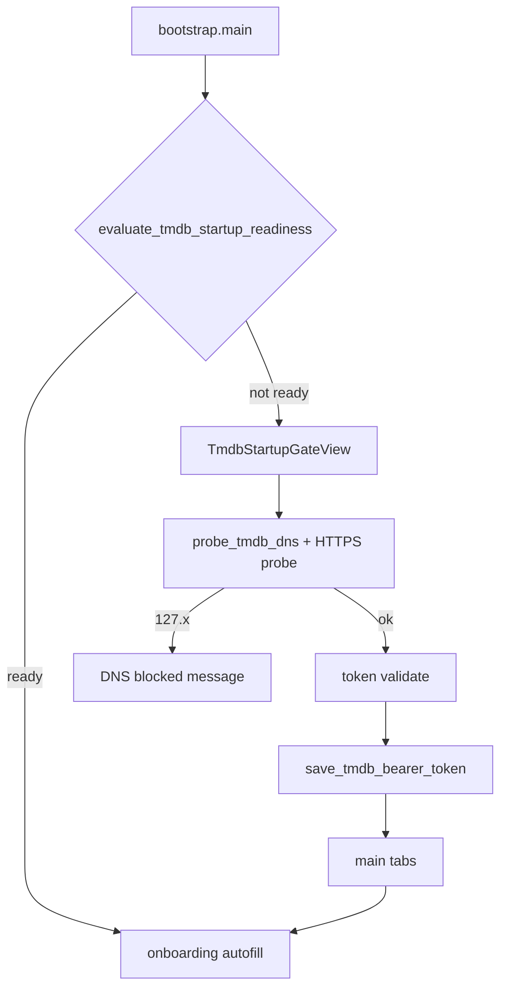

# Отчёт: TMDb Startup Gate + DNS check

- Дата: 2026-07-10
- Область: блокирующий стартовый экран TMDb, проверка DNS/сети, сохранение token

## Цель

1. Перед проверкой token/API — определить доступность TMDb (в РФ DNS часто отдаёт `127.x`).
2. Показать минималистичный стартовый экран ввода Bearer token; без прохождения gate недоступны main tabs, onboarding и pool refill.
3. Сохранять token в `data/.env.local`.

## Flow



## Изменения

### API

| Модуль | Назначение |
|--------|------------|
| [`apis/tmdb_connectivity.py`](../../apis/tmdb_connectivity.py) | `probe_tmdb_dns`, `check_tmdb_network_available`, `evaluate_tmdb_startup_readiness` |
| [`apis/tmdb_api.py`](../../apis/tmdb_api.py) | `get_tmdb_env_path`, `save_tmdb_bearer_token`, `has_tmdb_credentials`, `reload_tmdb_env`, загрузка `data/.env.local` |

Порядок проверок: **DNS → credentials → `/configuration`**.

### Desktop

| Модуль | Назначение |
|--------|------------|
| [`desktop/startup/tmdb_gate.py`](../../desktop/startup/tmdb_gate.py) | UI gate |
| [`desktop/startup/worker.py`](../../desktop/startup/worker.py) | async network probe + token validate |
| [`desktop/theme/styles/startup.py`](../../desktop/theme/styles/startup.py) | QSS |
| [`desktop/shell/main_window.py`](../../desktop/shell/main_window.py) | `maybe_show_tmdb_startup_gate`, блокировка onboarding/refill |
| [`desktop/shell/bootstrap.py`](../../desktop/shell/bootstrap.py) | вызов gate вместо прямого onboarding |

### i18n

Ключи `startup.tmdb.*` в [`desktop/i18n/catalog.py`](../../desktop/i18n/catalog.py) (ru/en).

## Поведение

- **DNS `127.x` / `::1`**: сообщение о блокировке, поле token и кнопка «Продолжить» отключены.
- **Нет token**: gate с вводом; после успешной проверки token пишется в `data/.env.local`.
- **Повторный запуск**: fast-path при валидных credentials + доступной сети — gate пропускается.
- **Секреты**: token не логируется в `gui_event_log`.

## Тесты

```powershell
py -m pytest tests/test_tmdb_connectivity.py tests/test_tmdb_credentials.py tests/test_tmdb_startup_gate.py tests/test_api_ping.py -q
```

Результат: **18 passed**.

## Визуальная проверка

Screenshot tooling не запускался в этой сессии. Layout проверен через unit-тесты и QSS/tokens; для Tier 2 можно снять `scripts/screenshots/capture_tmdb_startup_gate.py` на scale 1.0 (native Windows).

## Ограничения

- Редактирование token в Settings — вне scope.
- Kinopoisk gate не добавлялся.
